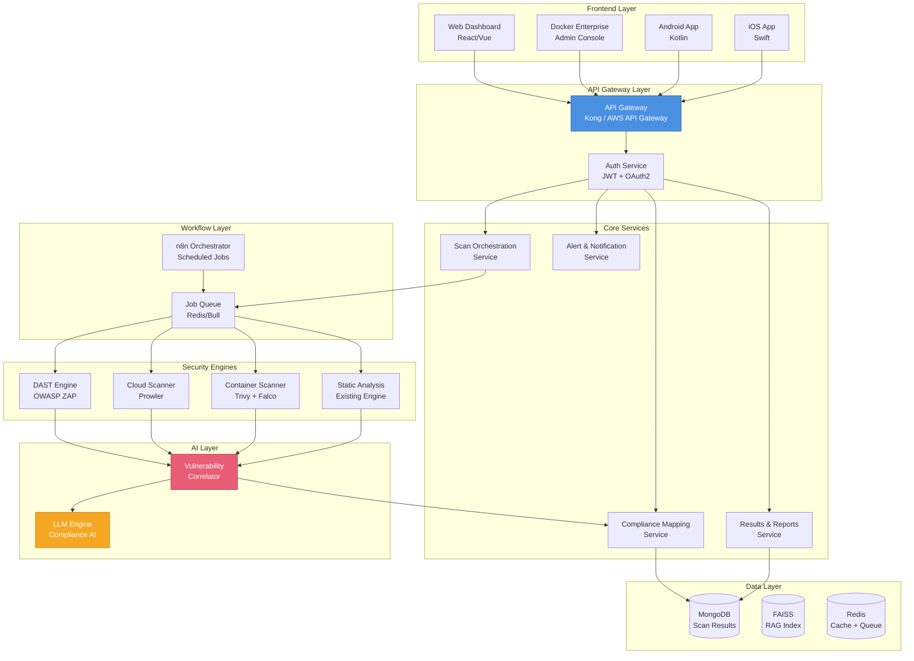
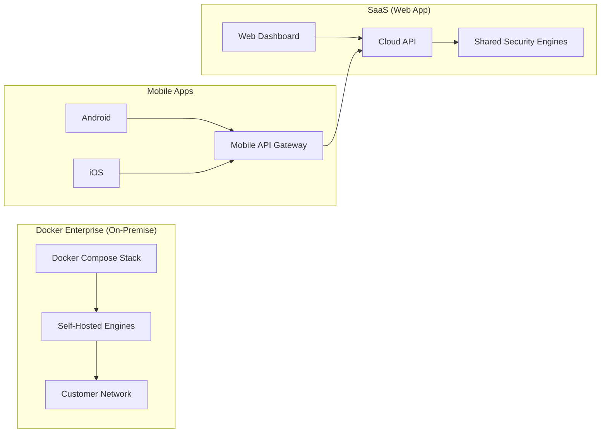
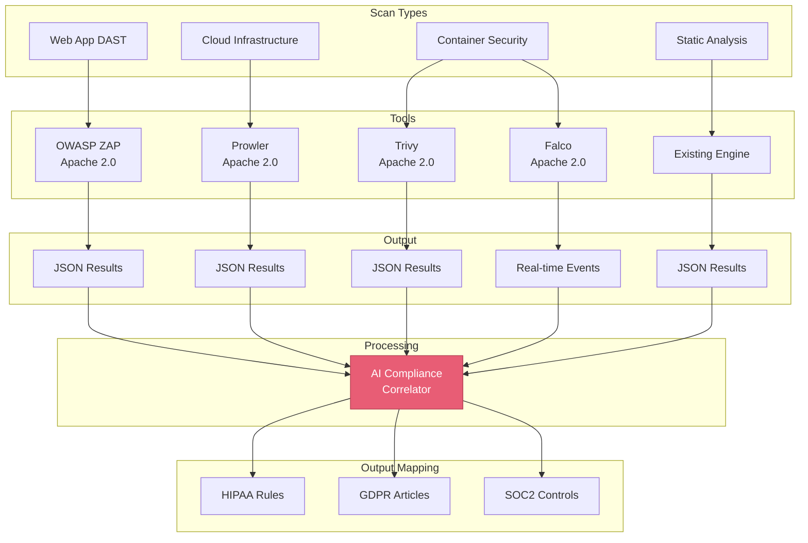
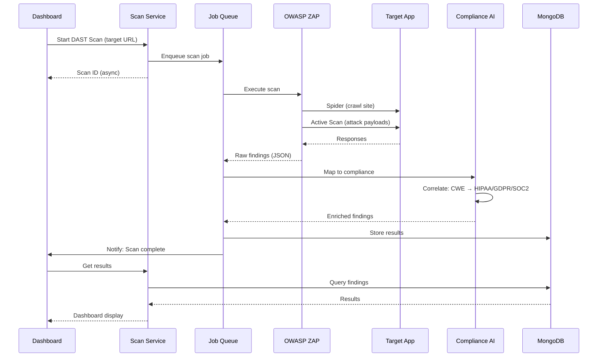
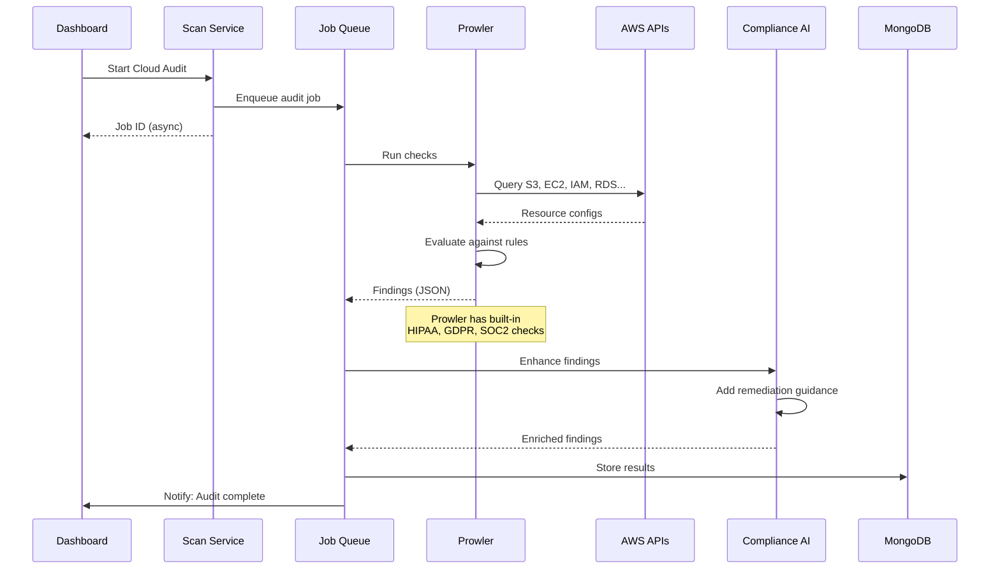
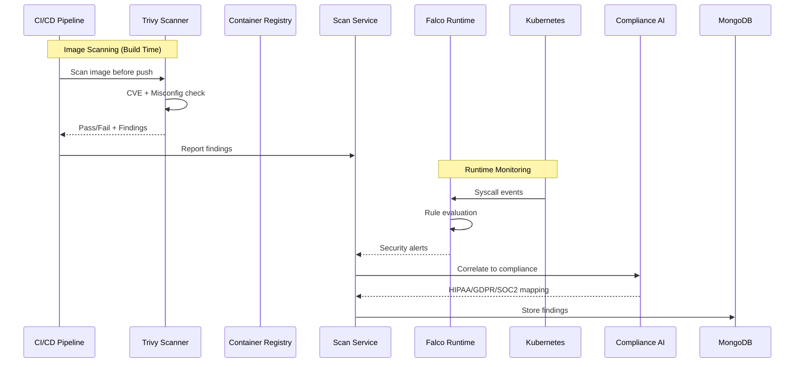

# Dynamic Vulnerability Analysis: Refined Strategic Roadmap
## Multi-Compliance Platform (HIPAA, GDPR, SOC2)

**Document Version:** 2.0  
**Date:** December 18, 2025  
**Status:** Strategic Research & Planning (Refined)  

---

## Table of Contents

1. [Executive Summary](#1-executive-summary)
2. [Addressing Known Roadmap Issues](#2-addressing-known-roadmap-issues)
3. [Architecture Redesign: Dashboard-First Approach](#3-architecture-redesign-dashboard-first-approach)
4. [Multi-Deployment Strategy](#4-multi-deployment-strategy)
5. [Dynamic Analysis Components](#5-dynamic-analysis-components)
6. [Multi-Compliance Integration](#6-multi-compliance-integration)
7. [Infrastructure & Cost Analysis](#7-infrastructure--cost-analysis)
8. [Implementation Roadmap](#8-implementation-roadmap)
9. [Tool Reference](#9-tool-reference)

---

## 1. Executive Summary

### Document Purpose

This refined document addresses:
- ✅ Dashboard-based UX (departing from chatbot-centric design)
- ✅ Multi-deployment support (Web, Docker Enterprise, Android, iOS)
- ✅ Simultaneous HIPAA/GDPR/SOC2 framework development
- ✅ Infrastructure cost analysis (no human resource assumptions)
- ✅ Mitigations for identified roadmap failure points

### Strategic Vision

```
┌─────────────────────────────────────────────────────────────────────┐
│              UNIFIED COMPLIANCE + SECURITY PLATFORM                  │
├─────────────────────────────────────────────────────────────────────┤
│                                                                     │
│   ┌─────────────┐  ┌─────────────┐  ┌─────────────┐  ┌──────────┐ │
│   │  Web App    │  │   Docker    │  │  Android    │  │   iOS    │ │
│   │  Dashboard  │  │  Enterprise │  │    App      │  │   App    │ │
│   └──────┬──────┘  └──────┬──────┘  └──────┬──────┘  └────┬─────┘ │
│          │                │                │               │       │
│          └────────────────┴────────────────┴───────────────┘       │
│                                    │                                │
│                    ┌───────────────▼───────────────┐               │
│                    │      UNIFIED API GATEWAY       │               │
│                    │   (REST + WebSocket + GraphQL) │               │
│                    └───────────────┬───────────────┘               │
│                                    │                                │
│   ┌────────────────────────────────┴────────────────────────────┐  │
│   │                    CORE SERVICES LAYER                       │  │
│   │                                                              │  │
│   │  ┌──────────┐ ┌──────────┐ ┌──────────┐ ┌────────────────┐ │  │
│   │  │ Static   │ │ Dynamic  │ │ Cloud    │ │ Compliance     │ │  │
│   │  │ Analysis │ │ Security │ │ Security │ │ Intelligence   │ │  │
│   │  │ Engine   │ │ Engine   │ │ Engine   │ │ Engine         │ │  │
│   │  └──────────┘ └──────────┘ └──────────┘ └────────────────┘ │  │
│   │                                                              │  │
│   │  ┌─────────────────────────────────────────────────────────┐│  │
│   │  │           AI COMPLIANCE CORRELATOR (LLM)                ││  │
│   │  │   Maps findings → HIPAA + GDPR + SOC2 simultaneously    ││  │
│   │  └─────────────────────────────────────────────────────────┘│  │
│   └─────────────────────────────────────────────────────────────┘  │
│                                                                     │
│   ┌─────────────────────────────────────────────────────────────┐  │
│   │                   WORKFLOW ORCHESTRATOR                      │  │
│   │            (n8n - Scheduled + Event-Driven Jobs)             │  │
│   └─────────────────────────────────────────────────────────────┘  │
│                                                                     │
└─────────────────────────────────────────────────────────────────────┘
```

---

## 2. Addressing Known Roadmap Issues

### Critical Issues Identified & Mitigations

Based on the roadmap analysis, here are the key issues and how Phase 4 addresses them:

| Issue | Original Problem | Phase 4 Mitigation |
|-------|-----------------|-------------------|
| **Chatbot Dependency** | All features routed through chat intent detection | Dashboard-first design with direct API access |
| **Single LLM Bottleneck** | All agents share one GPU | Separate processing queues; async job execution |
| **Webhook Security** | Public endpoints vulnerable | Signed webhooks + rate limiting + IP allowlisting |
| **Credential Sprawl** | Secrets across containers | Centralized secrets manager integration |
| **No Rollback Strategy** | Phase dependencies without fallback | Feature flags + versioned deployments |
| **Observability Gap** | No unified logging/tracing | OpenTelemetry + centralized logging from start |
| **Testing Void** | No test strategy defined | Automated security scan validation |

### Dashboard-First Design Rationale

**Why Depart from Chatbot-Centric:**

| Chatbot Approach | Dashboard Approach |
|------------------|-------------------|
| ❌ Intent detection can misroute (5% error = compliance exposure) | ✅ Direct actions, no interpretation needed |
| ❌ Sequential conversation limits parallel work | ✅ See all scans, results, trends at once |
| ❌ Industry unfamiliar with chat-based security tools | ✅ Industry-standard security dashboard format |
| ❌ Mobile apps struggle with complex chat UX | ✅ Native dashboard components work everywhere |
| ❌ Harder to audit and report | ✅ Structured data, easy export and compliance reporting |

**Hybrid Approach:**
- Dashboard for **primary interaction** (scan management, results, reporting)
- Chatbot for **optional AI assistance** (explain findings, suggest remediation)
- Both use **same backend APIs**

---

## 3. Architecture Redesign: Dashboard-First Approach

### 3.1 System Architecture Overview



### 3.2 Dashboard UX Design

#### Security Dashboard Components

```
┌─────────────────────────────────────────────────────────────────────┐
│  🛡️ Compliance Security Dashboard                    [User ▼] [⚙️] │
├─────────────────────────────────────────────────────────────────────┤
│                                                                     │
│  ┌──────────────────────────────────────────────────────────────┐  │
│  │  COMPLIANCE SCORE                                             │  │
│  │  ┌─────────┐  ┌─────────┐  ┌─────────┐                       │  │
│  │  │  HIPAA  │  │  GDPR   │  │  SOC2   │                       │  │
│  │  │   78%   │  │   85%   │  │   72%   │                       │  │
│  │  │  ▼ -3%  │  │  ▲ +2%  │  │  ━ 0%   │                       │  │
│  │  └─────────┘  └─────────┘  └─────────┘                       │  │
│  └──────────────────────────────────────────────────────────────┘  │
│                                                                     │
│  ┌─────────────────────────────┐ ┌──────────────────────────────┐  │
│  │  ACTIVE SCANS               │ │  RECENT FINDINGS             │  │
│  │  ─────────────────────────  │ │  ────────────────────────    │  │
│  │  ● Web App DAST      [72%]  │ │  🔴 Critical: 3              │  │
│  │  ● AWS Cloud Audit   [Done] │ │  🟠 High: 12                 │  │
│  │  ● Container Scan    [Queue]│ │  🟡 Medium: 45               │  │
│  │  [+ New Scan]               │ │  [View All →]                │  │
│  └─────────────────────────────┘ └──────────────────────────────┘  │
│                                                                     │
│  ┌──────────────────────────────────────────────────────────────┐  │
│  │  VULNERABILITY TREND (30 Days)                                │  │
│  │                                                                │  │
│  │  40 ─┬─────────────────────────────────────────────────────   │  │
│  │      │     ╱╲                                                 │  │
│  │  20 ─┤    ╱  ╲    ╱╲                                         │  │
│  │      │   ╱    ╲__╱  ╲___╱╲______                             │  │
│  │   0 ─┴─────────────────────────────────────────────────────   │  │
│  │      Dec 1                                          Dec 18    │  │
│  └──────────────────────────────────────────────────────────────┘  │
│                                                                     │
│  ┌──────────────────────────────────────────────────────────────┐  │
│  │  SCAN TYPES                                                   │  │
│  │  ────────────────────────────────────────────────────────     │  │
│  │  [🌐 Web DAST]  [☁️ Cloud Audit]  [📦 Container]  [📄 Static] │  │
│  │                                                                │  │
│  │  [📊 Generate Report]  [📤 Export CSV]  [🔔 Configure Alerts] │  │
│  └──────────────────────────────────────────────────────────────┘  │
│                                                                     │
└─────────────────────────────────────────────────────────────────────┘
```

#### Key Dashboard Features

| Feature | Description | Industry Standard |
|---------|-------------|-------------------|
| **Compliance Score Cards** | Real-time HIPAA/GDPR/SOC2 scores | ✅ Drata, Vanta style |
| **Active Scan Monitor** | Progress bars, queue status | ✅ Black Duck, Qualys style |
| **Finding Severity Breakdown** | Critical/High/Medium/Low counts | ✅ SAST/DAST tools |
| **Trend Analysis** | 30/60/90 day vulnerability trends | ✅ Security dashboards |
| **One-Click Scans** | Start scans without configuration | ✅ Easy onboarding |
| **Export & Reporting** | PDF/CSV for auditors | ✅ Compliance requirement |

---

## 4. Multi-Deployment Strategy

### 4.1 Deployment Models

Your product supports four deployment models. Here's how dynamic security features work in each:



### 4.2 Feature Matrix by Deployment

| Feature | Web App (SaaS) | Docker Enterprise | Android | iOS |
|---------|---------------|-------------------|---------|-----|
| **Dashboard** | ✅ Full | ✅ Full | ✅ Optimized | ✅ Optimized |
| **Start Scans** | ✅ | ✅ | ✅ | ✅ |
| **View Results** | ✅ | ✅ | ✅ | ✅ |
| **DAST Scanning** | ✅ Cloud-hosted | ✅ Self-hosted | Via API | Via API |
| **Cloud Audit (Prowler)** | ✅ | ✅ | ✅ | ✅ |
| **Container Scanning** | ✅ | ✅ | ⚠️ View only | ⚠️ View only |
| **Push Notifications** | ✅ Email/Slack | ✅ Email/Slack | ✅ Native | ✅ Native |
| **Offline Mode** | ❌ | ✅ | ✅ Cached | ✅ Cached |

### 4.3 Docker Enterprise Architecture

For on-premise deployments:

```yaml
# docker-compose.security.yml
version: '3.8'

services:
  # API Gateway
  api-gateway:
    image: kong:latest
    ports:
      - "8000:8000"
      - "8443:8443"
    environment:
      - KONG_DATABASE=off
      - KONG_DECLARATIVE_CONFIG=/etc/kong/kong.yml
    
  # Core Application
  compliance-api:
    image: hipaackr/compliance-api:latest
    environment:
      - DATABASE_URL=${DATABASE_URL}
      - REDIS_URL=${REDIS_URL}
      - LLM_ENDPOINT=http://llm-engine:8081
    depends_on:
      - mongodb
      - redis
  
  # DAST Engine
  owasp-zap:
    image: ghcr.io/zaproxy/zaproxy:stable
    command: zap.sh -daemon -host 0.0.0.0 -port 8080
    networks:
      - security-net
  
  # Cloud Scanner
  prowler:
    image: prowler:latest
    volumes:
      - ./aws-credentials:/root/.aws:ro
    networks:
      - security-net
  
  # Container Scanner  
  trivy:
    image: aquasec/trivy:latest
    volumes:
      - /var/run/docker.sock:/var/run/docker.sock:ro
    networks:
      - security-net
  
  # Workflow Orchestrator
  n8n:
    image: n8nio/n8n:latest
    environment:
      - N8N_BASIC_AUTH_ACTIVE=true
      - N8N_BASIC_AUTH_USER=${N8N_USER}
      - N8N_BASIC_AUTH_PASSWORD=${N8N_PASSWORD}
    ports:
      - "5678:5678"
  
  # LLM Engine
  llm-engine:
    image: ghcr.io/ggerganov/llama.cpp:server
    deploy:
      resources:
        reservations:
          devices:
            - capabilities: [gpu]
    volumes:
      - ./models:/models:ro
    command: -m /models/gpt-oss-20b-Q4_K_M.gguf --host 0.0.0.0 --port 8081
  
  # Data Layer
  mongodb:
    image: mongo:6.0
    volumes:
      - mongodb_data:/data/db
  
  redis:
    image: redis:7-alpine
    volumes:
      - redis_data:/data

volumes:
  mongodb_data:
  redis_data:

networks:
  security-net:
    driver: bridge
```

---

## 5. Dynamic Analysis Components

### 5.1 Component Overview

The Dynamic Security Analysis Layer consists of four integrated scanning components, each targeting a specific attack surface while sharing a common compliance correlation engine.



#### Component Summary Table

| Component | Tool | Purpose | Trigger Mode | Output |
|-----------|------|---------|--------------|--------|
| **Web DAST** | OWASP ZAP | Runtime web vulnerability testing | On-demand / Scheduled | JSON findings |
| **Cloud Audit** | Prowler | AWS/Azure/GCP compliance scanning | Scheduled / On-demand | JSON + HTML reports |
| **Container (Build)** | Trivy | Image CVE + misconfig scanning | CI/CD webhook | Pass/Fail + JSON |
| **Container (Runtime)** | Falco | Syscall-based threat detection | Continuous | Real-time alerts |
| **Static Analysis** | Existing Engine | Source code vulnerability scan | On-demand | JSON findings |

---

### 5.2 DAST Engine: OWASP ZAP

#### What It Does

**OWASP ZAP (Zed Attack Proxy)** is a DAST tool that tests **running web applications** by simulating real attacks. Unlike static analysis that reads code, DAST interacts with the live application exactly as an attacker would.

#### Key Capabilities

| Capability | Description |
|------------|-------------|
| **Spider/Crawler** | Automatically discovers all pages, forms, and endpoints |
| **Active Scanner** | Sends attack payloads to find exploitable vulnerabilities |
| **Passive Scanner** | Monitors traffic for security issues without attacking |
| **Authentication** | Supports form-based, OAuth, JWT, and custom auth |
| **API Scanning** | Tests REST/GraphQL APIs via OpenAPI spec import |
| **Headless Mode** | Runs as daemon for automation (Docker-friendly) |

#### Vulnerabilities Detected

| Category | Examples | OWASP Top 10 |
|----------|----------|--------------|
| **Injection** | SQL Injection, XSS, Command Injection | A03:2021 |
| **Broken Authentication** | Session fixation, weak tokens | A07:2021 |
| **Sensitive Data Exposure** | PII in URLs, unencrypted data | A02:2021 |
| **Security Misconfiguration** | Missing headers, debug enabled | A05:2021 |
| **Broken Access Control** | IDOR, path traversal | A01:2021 |

#### Compliance Mapping (Automatic)

| Finding Type | HIPAA | GDPR | SOC2 |
|--------------|-------|------|------|
| SQL Injection | §164.312(a)(1), §164.312(c)(1) | Article 32(1)(b) | CC6.1, CC7.2 |
| XSS | §164.312(c)(1) | Article 32(1)(b) | CC6.1 |
| Missing HTTPS | §164.312(e)(1) | Article 32(1)(a) | CC6.7 |
| Session Issues | §164.312(d) | Article 32(1)(b) | CC6.1 |

#### Dashboard Integration

```
┌─────────────────────────────────────────────────────────────────┐
│  🌐 Web Application DAST                                        │
├─────────────────────────────────────────────────────────────────┤
│  Target URL: [https://app.example.com        ] [🔍 Start Scan]  │
│                                                                 │
│  Scan Profile: [Standard ▼]  Auth: [Configured ✓]              │
│                                                                 │
│  ┌─────────────────────────────────────────────────────────┐   │
│  │  Last Scan: 2 hours ago                                  │   │
│  │  Duration: 45 minutes                                    │   │
│  │  Pages Crawled: 234                                      │   │
│  │  Findings: 🔴 2 Critical | 🟠 5 High | 🟡 12 Medium      │   │
│  └─────────────────────────────────────────────────────────┘   │
│                                                                 │
│  [📊 View Details]  [📥 Export Report]  [🔄 Schedule]           │
└─────────────────────────────────────────────────────────────────┘
```

#### Workflow



---

### 5.3 Cloud Audit Engine: Prowler

#### What It Does

**Prowler** is an open-source security tool that performs **automated security audits** of cloud infrastructure (AWS, Azure, GCP). It checks configurations against compliance frameworks and security best practices.

#### Key Capabilities

| Capability | Description |
|------------|-------------|
| **Multi-Cloud** | Supports AWS, Azure, GCP with unified output |
| **400+ Checks** | Comprehensive security and compliance rules |
| **Built-in Compliance** | Native HIPAA, GDPR, SOC2, PCI-DSS, CIS mappings |
| **JSON/HTML Output** | Machine-readable + human-readable reports |
| **Remediation Guidance** | Includes fix commands for each finding |
| **AWS Security Hub** | Direct integration for centralized findings |

#### What It Scans

| AWS Service | Checks Performed |
|-------------|-----------------|
| **S3** | Encryption, public access, versioning, logging |
| **EC2** | Security groups, EBS encryption, metadata service |
| **IAM** | MFA, password policy, access key rotation, policies |
| **RDS** | Encryption, public accessibility, backup retention |
| **CloudTrail** | Enabled, log validation, multi-region |
| **VPC** | Flow logs, default security groups, NACLs |
| **Lambda** | IAM roles, VPC configuration, environment variables |
| **EKS** | Control plane logging, secrets encryption |

#### Built-in Compliance Frameworks

| Framework | Checks | Command |
|-----------|--------|---------|
| **HIPAA** | 85+ | `prowler aws --compliance hipaa` |
| **GDPR** | 45+ | `prowler aws --compliance gdpr` |
| **SOC2** | 70+ | `prowler aws --compliance soc2` |
| **PCI-DSS** | 100+ | `prowler aws --compliance pci_dss` |
| **CIS AWS** | 200+ | `prowler aws --compliance cis` |

#### Dashboard Integration

```
┌─────────────────────────────────────────────────────────────────┐
│  ☁️ Cloud Infrastructure Audit                                  │
├─────────────────────────────────────────────────────────────────┤
│  Cloud Provider: [AWS ▼]  Account: [prod-12345678]             │
│  Compliance: [☑ HIPAA] [☑ GDPR] [☑ SOC2]                       │
│                                                                 │
│  [🔍 Run Audit Now]  [📅 Schedule: Daily 2AM]                  │
│                                                                 │
│  ┌─────────────────────────────────────────────────────────┐   │
│  │  Last Audit: Dec 18, 2025 02:15 AM                       │   │
│  │  Services Checked: 45                                     │   │
│  │  Rules Evaluated: 412                                     │   │
│  │                                                           │   │
│  │  Results:                                                 │   │
│  │  ✅ PASS: 389 | ❌ FAIL: 18 | ⚠️ INFO: 5                  │   │
│  │                                                           │   │
│  │  Critical Findings:                                       │   │
│  │  • S3 bucket 'logs-backup' has public read access        │   │
│  │  • IAM user 'deploy-bot' has no MFA enabled              │   │
│  │  • RDS instance 'prod-db' not encrypted at rest          │   │
│  └─────────────────────────────────────────────────────────┘   │
│                                                                 │
│  [📊 Full Report]  [📥 Export]  [🔧 Auto-Remediate]            │
└─────────────────────────────────────────────────────────────────┘
```

#### Workflow



---

### 5.4 Container Security: Trivy + Falco

Container security requires **two complementary tools**: Trivy for build-time scanning and Falco for runtime monitoring.

#### 5.4.1 Trivy: Build-Time Image Scanning

**What It Does:**
Trivy scans container images for **known vulnerabilities (CVEs)** and **misconfigurations** before they reach production.

| Capability | Description |
|------------|-------------|
| **CVE Detection** | Scans OS packages and language dependencies |
| **Misconfiguration** | Checks Dockerfile and K8s manifests |
| **Secret Scanning** | Detects hardcoded secrets and credentials |
| **License Scanning** | Identifies open-source license compliance |
| **SBOM Generation** | Creates Software Bill of Materials |
| **CI/CD Native** | Exit codes for pipeline gates |

**Supported Targets:**

| Target | What's Scanned |
|--------|---------------|
| Container Images | Docker, OCI images |
| Filesystems | Local directories |
| Git Repositories | Remote repos |
| Kubernetes | Cluster resources |
| IaC Files | Terraform, CloudFormation |

**Severity Levels:**

| Severity | Action | Pipeline |
|----------|--------|----------|
| **CRITICAL** | Block deployment | ❌ Fail |
| **HIGH** | Require review | ⚠️ Warn/Fail |
| **MEDIUM** | Track for remediation | ⚠️ Warn |
| **LOW** | Informational | ✅ Pass |

#### 5.4.2 Falco: Runtime Threat Detection

**What It Does:**
Falco monitors **running containers** by analyzing Linux kernel syscalls to detect suspicious behavior in real-time.

| Capability | Description |
|------------|-------------|
| **Syscall Monitoring** | Kernel-level visibility into container behavior |
| **Rule Engine** | Customizable YAML-based detection rules |
| **Real-time Alerts** | Immediate notification of threats |
| **K8s Audit Logs** | Monitors Kubernetes API server events |
| **Cloud Events** | AWS CloudTrail, GCP Audit Log integration |

**What It Detects:**

| Threat Category | Examples |
|-----------------|----------|
| **Shell Spawning** | Interactive shell in container |
| **File Access** | Reading /etc/shadow, SSH keys |
| **Network Activity** | Unexpected outbound connections |
| **Privilege Escalation** | setuid, capability changes |
| **Crypto Mining** | Mining process signatures |
| **Data Exfiltration** | Bulk file reads, unusual uploads |

**Example Falco Rules:**

```yaml
# Detect shell spawned in container
- rule: Terminal shell in container
  condition: >
    spawned_process and container and shell_procs
  output: >
    Shell spawned in container (user=%user.name container=%container.name)
  priority: WARNING

# Detect sensitive file access
- rule: Read sensitive file
  condition: >
    open_read and container and sensitive_files
  output: >
    Sensitive file read (file=%fd.name container=%container.name)
  priority: CRITICAL
```

#### Dashboard Integration

```
┌─────────────────────────────────────────────────────────────────┐
│  📦 Container Security                                          │
├─────────────────────────────────────────────────────────────────┤
│  ┌─────────────────────────────────────────────────────────┐   │
│  │  IMAGE SCANNING (Trivy)                                  │   │
│  │  ─────────────────────────────────────────────────────   │   │
│  │  Registry: ECR (aws-account.ecr.us-east-1.amazonaws.com) │   │
│  │  Images Scanned: 47                                      │   │
│  │  Last Scan: 15 minutes ago (CI/CD trigger)               │   │
│  │                                                          │   │
│  │  │ Image                    │ Critical │ High │ Status │ │   │
│  │  │ patient-api:v2.3.1       │    0     │  2   │ ⚠️     │ │   │
│  │  │ auth-service:v1.8.0      │    1     │  0   │ ❌     │ │   │
│  │  │ web-frontend:v3.0.0      │    0     │  0   │ ✅     │ │   │
│  └─────────────────────────────────────────────────────────┘   │
│                                                                 │
│  ┌─────────────────────────────────────────────────────────┐   │
│  │  RUNTIME MONITORING (Falco)                              │   │
│  │  ─────────────────────────────────────────────────────   │   │
│  │  Cluster: prod-k8s-cluster                               │   │
│  │  Pods Monitored: 156                                     │   │
│  │  Status: 🟢 Active                                       │   │
│  │                                                          │   │
│  │  Recent Alerts (24h):                                    │   │
│  │  • 🔴 Shell spawned in patient-api pod (2h ago)         │   │
│  │  • 🟠 Sensitive file read in auth-service (6h ago)      │   │
│  │  • 🟡 Unexpected outbound connection (12h ago)          │   │
│  └─────────────────────────────────────────────────────────┘   │
│                                                                 │
│  [📊 View All Findings]  [🔔 Alert Settings]                   │
└─────────────────────────────────────────────────────────────────┘
```

#### Workflow



#### Container → Compliance Mapping

| Finding Type | HIPAA | GDPR | SOC2 |
|--------------|-------|------|------|
| Critical CVE in image | §164.308(a)(1) | Article 32(1)(a) | CC7.1 |
| Hardcoded secrets | §164.312(a)(1) | Article 32(1)(b) | CC6.1 |
| Shell in container | §164.312(b) | Article 32(1)(d) | CC7.2 |
| Unauthorized network access | §164.312(e)(1) | Article 32(1)(a) | CC6.6 |
| Privilege escalation | §164.312(a)(1) | Article 32(1)(b) | CC6.1 |

---

## 6. Multi-Compliance Integration

### 6.1 Simultaneous Framework Support

All three frameworks (HIPAA, GDPR, SOC2) are evaluated **simultaneously** for every finding:

```json
{
  "finding": {
    "id": "vuln-12345",
    "type": "SQL_INJECTION",
    "severity": "CRITICAL",
    "source": "DAST",
    "location": "/api/patients/search"
  },
  "compliance_mapping": {
    "hipaa": {
      "rules": ["§164.312(a)(1)", "§164.312(c)(1)"],
      "category": "Technical Safeguards",
      "risk": "PHI data breach via SQL injection",
      "priority": "IMMEDIATE"
    },
    "gdpr": {
      "articles": ["Article 32(1)(b)", "Article 5(1)(f)"],
      "category": "Security of Processing",
      "risk": "Personal data integrity breach",
      "priority": "HIGH"
    },
    "soc2": {
      "controls": ["CC6.1", "CC7.2"],
      "category": "Logical Access Controls",
      "risk": "Unauthorized data access",
      "priority": "HIGH"
    }
  },
  "remediation": {
    "summary": "Use parameterized queries",
    "code_example": "cursor.execute('SELECT * FROM patients WHERE id = ?', (id,))",
    "verification": "Re-run DAST scan after fix"
  }
}
```

### 6.2 Compliance Rule Database

```
config/
├── compliance/
│   ├── vulnerability_mappings.json    # CVE/CWE → Framework rules
│   ├── cloud_mappings.json            # Prowler checks → Framework rules
│   ├── container_mappings.json        # Trivy findings → Framework rules
│   └── severity_weights.json          # Framework-specific severity
```

**Example Mapping Entry:**

```json
{
  "SQL_INJECTION": {
    "cwe": "CWE-89",
    "owasp": "A03:2021",
    "severity_base": "CRITICAL",
    "hipaa": {
      "rules": ["§164.312(a)(1)", "§164.312(c)(1)"],
      "severity_override": "CRITICAL",
      "phi_risk": true
    },
    "gdpr": {
      "articles": ["Article 32(1)(b)"],
      "severity_override": "HIGH",
      "personal_data_risk": true
    },
    "soc2": {
      "controls": ["CC6.1", "CC7.2"],
      "severity_override": "HIGH"
    }
  }
}
```

### 6.3 Compliance Score Calculation

Each framework gets an independent score:

```
Compliance Score = 100 - Σ(finding_weight × finding_count)

Where:
- Critical finding = 15 points
- High finding = 8 points  
- Medium finding = 3 points
- Low finding = 1 point

Minimum score = 0
```

**Dashboard Display:**
```
HIPAA Score: 78% (▼ -3% from last week)
  - Critical: 1 (-15)
  - High: 2 (-16)  
  
GDPR Score: 85% (▲ +2% from last week)
  - Critical: 0
  - High: 1 (-8)
  
SOC2 Score: 72% (━ no change)
  - Critical: 1 (-15)
  - High: 3 (-24)
```

---

## 7. Infrastructure & Cost Analysis

### 7.1 Current Production Infrastructure

Based on your existing AWS infrastructure in **us-east-1**:


#### Existing EC2 Instances

| Instance Name | Instance Type | vCPU | RAM | GPU | Region | Monthly Cost (On-Demand) |
|---------------|---------------|------|-----|-----|--------|-------------------------|
| **hipaachecker-production** | c6i.4xlarge | 16 | 32GB | - | us-east-1b | ~$489/month |
| **hipaachecker-staging** | c5.xlarge | 4 | 8GB | - | us-east-1d | ~$122/month |
| **generic-security-production** | c5.large | 2 | 4GB | - | us-east-1d | ~$61/month |
| **soc-production** | c5.xlarge | 4 | 8GB | - | us-east-1a | ~$122/month |
| **hipaa-LLM-service** | g4dn.8xlarge | 32 | 128GB | Tesla T4 | us-east-1a | ~$1,567/month |
| **gdpr-production** | c5.xlarge | 4 | 8GB | - | us-east-1c | ~$122/month |

#### Current Total Monthly Cost (Compute Only)

| Category | Monthly Cost |
|----------|-------------|
| **EC2 Instances (6)** | ~$2,483/month |
| EBS Storage (estimated 200GB each × 6) | ~$120/month |
| Data Transfer (estimated) | ~$50/month |
| **Current Infrastructure Total** | **~$2,653/month** |

> [!NOTE]
> Costs assume on-demand pricing. Reserved Instances or Savings Plans could reduce these by 30-40%.

---

### 7.2 Phase 4 Integration Options

#### Option A: Deploy on Existing hipaa-LLM-service (g4dn.8xlarge)

Your **hipaa-LLM-service** instance has significant headroom:
- **32 vCPU, 128GB RAM** - currently likely underutilized
- Security tools require minimal resources (~4GB RAM total)

| Component | Resource Usage | Fits on hipaa-LLM-service? |
|-----------|---------------|---------------------------|
| OWASP ZAP | ~2GB RAM, 2 vCPU | ✅ Yes |
| Prowler | ~500MB RAM (on-demand) | ✅ Yes |
| Trivy | ~500MB RAM | ✅ Yes |
| n8n | ~1GB RAM | ✅ Yes |
| Redis Queue | ~512MB RAM | ✅ Yes |
| **Total Additional** | ~4.5GB RAM, 2-4 vCPU | ✅ Plenty of capacity |

**Option A Result:** **$0 additional monthly cost**

> [!TIP]
> Recommended if scan volume is moderate and LLM inference isn't continuous.

---

#### Option B: Dedicated Security Worker (Recommended for Production)

For isolation and guaranteed resources, add a dedicated instance:

| Component | Instance Type | Specification | Monthly Cost |
|-----------|--------------|---------------|--------------|
| Security Worker | t3.xlarge | 4 vCPU, 16GB RAM | ~$120/month |
| | | OWASP ZAP, Prowler, Trivy, n8n, Redis | |
| **Option B Total** | | | **+$120/month** |

**New Total with Option B:** $2,653 + $120 = **~$2,773/month**

---

#### Option C: Scalable Multi-Tier Setup

For enterprise-grade deployment with high availability:

| Component | Service | Specification | Monthly Cost |
|-----------|---------|---------------|--------------|
| Security Worker 1 | t3.xlarge | Primary security tools | ~$120/month |
| Security Worker 2 | t3.xlarge | Failover/load distribution | ~$120/month |
| ElastiCache Redis | cache.t3.small | Managed queue + cache | ~$25/month |
| ALB | Application LB | Cross-AZ load balancing | ~$22/month |
| S3 | Storage | Scan results archive | ~$23/month |
| CloudWatch | Enhanced | Logs + Metrics + Alarms | ~$50/month |
| Secrets Manager | 15 secrets | Credential storage | ~$6/month |
| **Option C Total** | | | **+$366/month** |

**New Total with Option C:** $2,653 + $366 = **~$3,019/month**

---

### 7.3 Cost Comparison Summary

| Option | Additional Cost | New Total | Best For |
|--------|----------------|-----------|----------|
| **Option A** | $0 | ~$2,653/month | Quick start, low-moderate volume |
| **Option B** | +$120/month | ~$2,773/month | Production, isolation |
| **Option C** | +$366/month | ~$3,019/month | Enterprise, high availability |

### 7.4 Per-Product Cost Distribution

With Phase 4 (Option B), costs can be allocated per product:

| Product | Current Instances | Phase 4 Share | Estimated Monthly |
|---------|------------------|---------------|-------------------|
| **HIPAA Checker** | hipaachecker-production, staging, hipaa-LLM-service | 50% | ~$1,100 |
| **SOC2 Checker** | soc-production | 15% | ~$180 |
| **GDPR Checker** | gdpr-production | 15% | ~$180 |
| **Generic Security** | generic-security-production | 10% | ~$130 |
| **Shared Security (Phase 4)** | Security Worker | 10% | ~$120 |

---

### 7.5 Per-Scan Cost Estimates

Based on existing infrastructure + Option B:

| Scan Type | Duration | Compute Cost | Notes |
|-----------|----------|--------------|-------|
| Web DAST (small site) | 10-30 min | ~$0.05 | Per t3.xlarge hour |
| Web DAST (large site) | 1-4 hours | ~$0.16 | Extended scan |
| Cloud Audit (Prowler) | 5-15 min | ~$0.02 | AWS API calls free tier |
| Container Scan (Trivy) | 1-5 min | ~$0.01 | Fast execution |
| Static Analysis | Varies | Included | Uses hipaa-LLM-service |

### 7.6 Mobile App Costs (Unchanged)

| Platform | Store Fee | Push Notifications |
|----------|-----------|-------------------|
| Android | $25/year | Firebase (free tier) |
| iOS | $99/year | APNS (free tier) |

---

### 7.7 Cost Optimization Recommendations

| Strategy | Potential Savings | Notes |
|----------|------------------|-------|
| Reserved Instances (1-year) | 30-35% | For stable workloads |
| Savings Plans (3-year) | 40-50% | Commit to compute spend |
| Spot Instances for Security Worker | 60-70% | Acceptable for batch scanning |
| Right-sizing c5.xlarge → c5.large | ~$60/month | If underutilized |
| Consolidate staging to t3.large | ~$60/month | Staging doesn't need c5.xlarge |

**Potential Optimized Total (with 1-year Reserved):** ~$1,800/month (vs $2,773)

---

## 8. Implementation Roadmap

### 8.1 Phase 4 Timeline

| Phase | Duration | Focus |
|-------|----------|-------|
| **4.1** | 4 weeks | Dashboard foundation + DAST integration |
| **4.2** | 3 weeks | Cloud security (Prowler) + Multi-compliance mapping |
| **4.3** | 3 weeks | Container security (Trivy + Falco) |
| **4.4** | 4 weeks | AI Compliance Correlator + Reporting |
| **4.5** | 2 weeks | Mobile apps update + Polish |
| **Total** | **16 weeks** | |

### 8.2 Phase 4.1: Dashboard + DAST Foundation

**Deliverables:**
- [ ] Security Dashboard UI (React component library)
- [ ] Scan Service API (start/stop/status)
- [ ] OWASP ZAP Docker integration
- [ ] Job Queue (Redis + Bull)
- [ ] Basic results storage (MongoDB schema)
- [ ] Webhook security (signed + rate-limited)

**Infrastructure Needed:**
- t3.large instance for security tools
- Redis ElastiCache

**Success Criteria:**
- Dashboard displays scan status
- DAST scan completes for test application
- Results stored and retrievable

---

### 8.3 Phase 4.2: Cloud Security + Compliance Mapping

**Deliverables:**
- [ ] Prowler integration (scheduled + on-demand)
- [ ] AWS/Azure/GCP credential management (Secrets Manager)
- [ ] Compliance mapping database (HIPAA + GDPR + SOC2)
- [ ] Score calculation engine
- [ ] Framework-specific dashboards

**Infrastructure Needed:**
- Secrets Manager setup
- IAM roles for Prowler

**Success Criteria:**
- Prowler scan runs against test AWS account
- Findings mapped to all three frameworks
- Compliance scores display on dashboard

---

### 8.4 Phase 4.3: Container Security

**Deliverables:**
- [ ] Trivy CI/CD integration webhook
- [ ] Container registry scanning
- [ ] Falco runtime monitoring (optional)
- [ ] Container findings → compliance mapping

**Success Criteria:**
- Container push triggers Trivy scan
- CVEs mapped to compliance frameworks
- Dashboard shows container security status

---

### 8.5 Phase 4.4: AI Compliance Correlator

**Deliverables:**
- [ ] LLM-based finding enrichment
- [ ] Remediation suggestion generation
- [ ] Cross-scan correlation (static + dynamic findings)
- [ ] Report generation (PDF/CSV)
- [ ] Trend analysis charts

**Success Criteria:**
- AI adds context to findings
- Reports generate with compliance citations
- 30-day trend analysis functional

---

### 8.6 Phase 4.5: Mobile + Polish

**Deliverables:**
- [ ] Android app dashboard update
- [ ] iOS app dashboard update
- [ ] Push notification for critical findings
- [ ] Performance optimization
- [ ] Documentation

**Success Criteria:**
- Mobile apps show scan results
- Push notifications work
- <3s dashboard load time

---

## 9. Tool Reference

### All Tools: Apache 2.0 Licensed (Commercial Use Free)

| Tool | Version | Docker Image | Purpose |
|------|---------|--------------|---------|
| OWASP ZAP | 2.14+ | `ghcr.io/zaproxy/zaproxy:stable` | Web DAST |
| Prowler | 3.0+ | `prowler` | Cloud compliance |
| Trivy | 0.48+ | `aquasec/trivy:latest` | Container scanning |
| Falco | 0.37+ | `falcosecurity/falco:latest` | Runtime security |
| n8n | 1.0+ | `n8nio/n8n:latest` | Workflow automation |

### Quick Start Commands

```bash
# OWASP ZAP - Start daemon
docker run -d --name zap -p 8080:8080 ghcr.io/zaproxy/zaproxy:stable \
  zap.sh -daemon -host 0.0.0.0 -port 8080

# Prowler - HIPAA scan
docker run --rm -v ~/.aws:/root/.aws:ro prowler aws --compliance hipaa -M json

# Trivy - Scan container image
docker run --rm aquasec/trivy:latest image nginx:latest --format json

# n8n - Start workflow engine
docker run -d --name n8n -p 5678:5678 n8nio/n8n:latest
```

---

## Summary

### Key Changes from Original Research

| Aspect | Original | Refined |
|--------|----------|---------|
| **UX Model** | Chatbot-centric | Dashboard-first |
| **Framework Priority** | HIPAA-first | All three simultaneous |
| **Deployment** | Single model | Web + Docker + Mobile |
| **Resource Focus** | Human staffing | Infrastructure costs |
| **API Security** | FHIR/HL7 focused | De-prioritized |
| **Architecture** | Chat intent routing | Direct API + Queue |
| **Failure Mitigations** | Not addressed | Integrated throughout |

### Investment Summary

| Item | Cost |
|------|------|
| **Current Infrastructure** | ~$2,653/month (6 instances) |
| **Phase 4 Addition (Option B)** | +$120/month |
| **All Security Tools** | $0 (Apache 2.0) |
| **Total with Phase 4** | ~$2,773/month |
| **Implementation Timeline** | 16 weeks |

### Competitive Advantage

By completing Phase 4, you create a platform that:

1. **Performs active security testing** (unlike Drata, Vanta, Sprinto)
2. **Maps to compliance frameworks** (unlike Black Duck, Veracode)
3. **Works on-premise and cloud** (enterprise flexibility)
4. **Uses industry-standard dashboard UX** (familiar to security teams)
5. **Adds ~5% infrastructure cost** for comprehensive security testing

---

**Document Version:** 2.0  
**Last Updated:** December 18, 2025  
**Status:** Ready for Review
